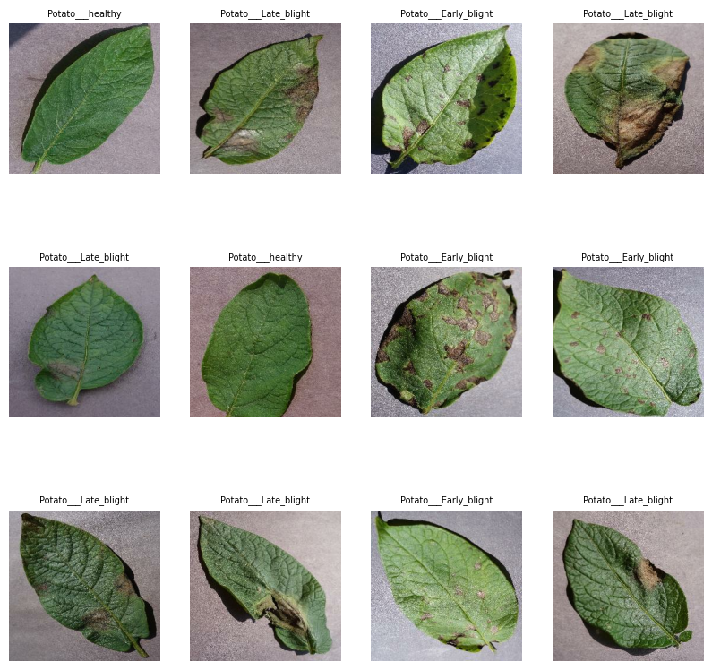

# Leaf_Disease_Classification

Computer vision project

# Potato Disease Detection Project

## Project Overview

In the world of farming, potato plants face a major problem: diseases. Two of the most troublesome ones are called early blight and late blight. These diseases can seriously harm potato crops, causing significant losses for farmers. Our project is all about finding a way to spot these diseases early, so farmers can take action quickly and protect their potato plants.

## Purpose

The main purpose of this project is to develop a system for early detection of potato diseases, specifically targeting early blight and late blight. By implementing a reliable detection method, we aim to help farmers identify the diseases in their potato crops at an early stage. This will enable them to take timely measures to mitigate the damage, potentially saving their crops and reducing financial losses.

## Dataset

I have obtained a labeled dataset of potato plant leaves from Kaggle, which serves as the foundation of our potato disease detection project. This dataset includes images of potato leaves with corresponding labels indicating whether they are healthy or affected by early blight, late blight, or other diseases. The dataset is available on Kaggle at [link_to_dataset](<[https://www.kaggle.com/yourusername/potato-leaf-dataset](https://www.kaggle.com/datasets/muhammadardiputra/potato-leaf-disease-dataset)>).

## Used Technologies

This project utilizes the following technologies:

- **Python**: The primary programming language used for development.

- **Matplotlib**: A popular Python library for creating data visualizations.

- **TensorFlow**: An open-source machine learning framework for building and training machine learning and deep learning models.

- **Google Cloud Platform (GCP)**: Used for deployment and hosting the potato disease detection system.

### Dataset Details

- Total Images: 2552
- Classes: Healthy, Early Blight, Late Blight
- Split: Training, Validation, Testing

The dataset is divided into training, validation, and testing sets to facilitate model training and evaluation. We have utilized this dataset to train and validate our disease detection models.

Please refer to the dataset's Kaggle page for more details on its usage and licensing.

## Data Preprocessing

Before training our potato disease detection models, we performed several data preprocessing steps to enhance the quality and diversity of our dataset. These steps include:

- **Rescaling**: We rescaled the pixel values of the images to a normalized range.

- **Resizing**: To standardize the input dimensions for our models, we resized all images to a common resolution (e.g., 256x256 pixels).

- **Data Augmentation**: Data augmentation techniques were applied to increase the dataset's diversity and robustness. This includes random rotations, flips, brightness adjustments, and other transformations to create variations of the original images.

These preprocessing steps were essential in preparing our dataset for training, ensuring that our models could learn effectively from the available data.

## Model Architecture

Our potato disease detection model is built using TensorFlow's Keras API. This architecture has been carefully designed to effectively identify and classify potato plant leaves into different disease categories. Below is a breakdown of the key components of our model:

- **Input Layer**: The input shape is defined as `(BATCH_SIZE, IMAGE_SIZE, IMAGE_SIZE, CHANNELS)` to accommodate variations in batch size, image dimensions, and color channels.

- **Preprocessing**: Prior to entering the convolutional layers, we apply a preprocessing step called `resize_and_rescale`, which both resizes and rescales the input images.

- **Convolutional Layers**: Our model includes multiple convolutional layers, each responsible for learning and extracting essential features from the input images. The ReLU activation function is applied to introduce non-linearity into the model.

- **Max-Pooling Layers**: Following each convolutional layer, there is a max-pooling layer with a pool size of `(2, 2)`. These layers help reduce the spatial dimensions of the feature maps while retaining important information.

- **Flatten Layer**: After the convolutional and max-pooling layers, we employ a flatten layer to reshape the 2D feature maps into a 1D vector, preparing the data for the fully connected layers.

- **Dense Layers**: Our model incorporates two dense layers. The first dense layer comprises 64 neurons and employs the ReLU activation function. The second dense layer is the output layer, which consists of `n_classes` neurons, where `n_classes` represents the number of disease classes. The output layer uses the softmax activation function to generate class probabilities.

- **Model Building**: To complete the model's construction, we utilize the `model.build()` statement, specifying the input shape.

## Model Training

We used the Kaggle dataset to train machine learning or deep learning models for potato disease detection. The training process, model architectures, and results can be found in the [Model Training](./docs/model_training.md) documentation.
